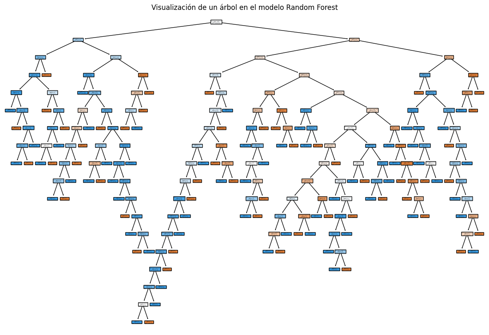

# RandomForestClassifier

**Overview / Descripción General**

The RandomForestClassifier is an ensemble learning method used for classification tasks.
El RandomForestClassifier es un método de aprendizaje en conjunto utilizado para tareas de clasificación. It builds multiple decision trees and merges them together to get a more accurate and stable prediction.
Construye múltiples árboles de decisión y los fusiona para obtener una predicción más precisa y estable. The idea is to create a "forest" of trees, where each tree is trained on a different subset of the data, helping to reduce overfitting and improve generalization.
La idea es crear un "bosque" de árboles, donde cada árbol se entrena en un subconjunto diferente de los datos, ayudando a reducir el sobreajuste y mejorar la generalización.

**How It Works / Cómo Funciona**

1. Data Sampling: The algorithm uses bootstrapping to create several subsets of the training data. Each subset is used to train a separate decision tree.

-----------
Muestreo de Datos: El algoritmo utiliza el muestreo con reemplazo (bootstrapping) para crear varios subconjuntos de los datos de entrenamiento. Cada subconjunto se utiliza para entrenar un árbol de decisión separado.

---------------

2. Building Trees: For each decision tree, a random subset of features is selected at each split, which helps to ensure that the trees are diverse. This randomness contributes to the strength of the ensemble model.
-----------------
Construcción de Árboles: Para cada árbol de decisión, se selecciona un subconjunto aleatorio de características en cada división, lo que ayuda a garantizar que los árboles sean diversos. Esta aleatoriedad contribuye a la fortaleza del modelo en conjunto.

---------------

3. Prediction: When making predictions, each tree in the forest gives a vote for a class label. The final prediction is made by selecting the class with the majority vote (majority voting).

---------------

Predicción: Al hacer predicciones, cada árbol en el bosque emite un voto para una etiqueta de clase. La predicción final se realiza seleccionando la clase con el voto mayoritario (votación mayoritaria).

-------------------

4. Feature Importance: Random forests can provide insights into feature importance by measuring how much each feature contributes to the predictions.

------------
Importancia de Características: Los bosques aleatorios pueden proporcionar información sobre la importancia de las características midiendo cuánto contribuye cada característica a las predicciones.

--------

**Advantages / Ventajas**

* Reduces overfitting compared to individual decision trees./
        Reduce el sobreajuste en comparación con árboles de decisión individuales.
* Handles large datasets with high dimensionality well./Maneja bien conjuntos de datos grandes con alta dimensionalidad.
* Robust to noise and outliers./Robusto frente al ruido y a los valores atípicos.
* Provides a measure of feature importance./Proporciona una medida de la importancia de las características.

# Random Forest Classifier Implementation

## Description
This project implements a Random Forest classifier using a dataset that contains information about stars (Kepler_ID, Metallicity, Classification, and classification uncertainty). An exploratory data analysis (EDA) is performed followed by training and evaluating the model.

## Project Structure

- **DataFrame**: A DataFrame is created using the provided data.
- **EDA**:
  - Information about the DataFrame and descriptive statistics are printed.
  - The distribution of the target variable `Classification` is visualized.
  - A histogram for the `Metallicity` variable is generated.
  - A heatmap is created to visualize the correlation between numeric variables.
- **Preprocessing**:
  - The categorical variable `Classification` is encoded using `LabelEncoder`.
  - Features (X) and the target variable (y) are separated.
- **Data Splitting**: The data is split into training and testing sets.
- **Random Forest Model**:
  - A `RandomForestClassifier` model is created and trained with a reduced number of trees for easier visualization.
- **Visualization**:
  - A bar chart showing the feature importances of the model is displayed.
  - An individual tree from the Random Forest model is visualized.

- **Evaluation**:
  - Predictions are made and the model is evaluated using a classification report.

## Requirements

Make sure to have the following libraries installed in your Python environment:

- pandas
- seaborn
- matplotlib
- scikit-learn
- numpy

1. Precisión (precision):

    * CANDIDATE: 0.89 (89%), significa que el 89% de las predicciones que el modelo hizo como "CANDIDATE" fueron correctas.
    * FALSE POSITIVE: 0.94 (94%), significa que el 94% de las predicciones como "FALSE POSITIVE" fueron correctas.
    * En general, el modelo tiene una precisión algo mayor para la clase "FALSE POSITIVE" en comparación con "CANDIDATE".

2. Recall:

    * CANDIDATE: 0.92 (92%), indica que el modelo identificó correctamente el 92% de todos los verdaderos "CANDIDATE".
    * FALSE POSITIVE: 0.92 (92%), lo que significa que detectó el 92% de los verdaderos "FALSE POSITIVE".
    * Ambos valores son altos, lo que implica que el modelo es efectivo en la detección de ambas clases.

3. F1-Score:

    * CANDIDATE: 0.90, combina precisión y recall y sugiere que el modelo es muy equilibrado en la clasificación de "CANDIDATE".
    * FALSE POSITIVE: 0.93, ligeramente mejor en comparación con "CANDIDATE", lo cual indica un buen balance entre precisión y recall.

4. Métricas generales:

    * Accuracy: 0.92 (92%), muestra el porcentaje total de predicciones correctas para ambas clases.
    * Macro avg: Promedio sin ponderar de precisión, recall y F1 para las dos clases, útil cuando las clases son balanceadas.
    * Weighted avg: Promedio ponderado de precisión, recall y F1, considera la proporción de cada clase en el conjunto de datos.

En resumen, el modelo tiene un buen desempeño general, con un 92% de precisión total. La ligera superioridad en "FALSE POSITIVE" podría deberse a una mayor cantidad de ejemplos en esa clase, como lo sugiere el soporte (número de casos).