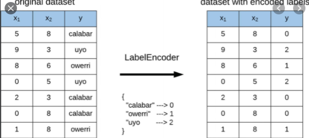

# **What is KNN?**

The K-Nearest Neighbors (KNN) algorithm is a supervised machine learning model used for classification and regression tasks. It operates by identifying the closest training examples to a new data point and predicting its label based on the most common label among its neighbors. The "K" parameter represents the number of neighbors to consider, with a typical choice being a small, odd number to avoid ties in classification. KNN is known for its simplicity, intuitive nature, and effectiveness, especially in cases with clearly defined boundaries between classes.

-----------------------------------------------------------------------

# **¿Qué es KNN?**

El K-Nearest Neighbors (KNN) es un modelo de aprendizaje supervisado utilizado para tareas de clasificación y regresión. Funciona identificando los ejemplos de entrenamiento más cercanos a un nuevo punto de datos y prediciendo su etiqueta en función de la etiqueta más común entre sus vecinos. El parámetro "K" representa la cantidad de vecinos a considerar, siendo común elegir un número pequeño e impar para evitar empates en la clasificación. KNN es conocido por su simplicidad, naturaleza intuitiva y efectividad, especialmente en casos con límites claramente definidos entre clases.

----------

## Code Description / Descripción del Código

1. Data Preprocessing / Preprocesamiento de Datos:
    * The code begins by loading and preparing the dataset, dropping redundant and irrelevant features to focus on important information.
    * El código comienza cargando y preparando el conjunto de datos, eliminando características redundantes e irrelevantes para centrarse en la información importante.

2. Label Encoding the Target Variable / Codificación de la Variable Objetivo:
    * The target variable DESERSIÓN is encoded using LabelEncoder, converting categorical values into a numerical format. This step is essential for KNN and other models that require numerical input, especially for binary classification problems where 0 represents no dropout, and 1 represents dropout.
    * La variable objetivo DESERSIÓN se codifica con LabelEncoder, convirtiendo los valores categóricos a formato numérico. Este paso es esencial para KNN y otros modelos que requieren entradas numéricas, especialmente en problemas de clasificación binaria, donde 0 representa no deserción y 1 representa deserción.

3. Data Splitting and Balancing / División y Balanceo de Datos:
    * The dataset is split into training and testing sets. SMOTEENN is used to balance the training data by applying oversampling and undersampling, which helps handle class imbalances in the target variable.
    * El conjunto de datos se divide en datos de entrenamiento y prueba. SMOTEENN se utiliza para balancear los datos de entrenamiento mediante sobremuestreo y submuestreo, lo cual ayuda a manejar desequilibrios en la variable objetivo.

4. KNN Model Training and Evaluation / Entrenamiento y Evaluación del Modelo KNN:
    * A KNN classifier is trained with the balanced training data, making predictions on the test data. Model performance is evaluated using accuracy, a classification report, and a confusion matrix to assess model effectiveness.
    * Un clasificador KNN se entrena con los datos de entrenamiento balanceados, realizando predicciones sobre los datos de prueba. El rendimiento del modelo se evalúa utilizando la precisión, un informe de clasificación y una matriz de confusión para evaluar la efectividad del modelo.

5. Visualization with PCA / Visualización con PCA:
    * PCA reduces the feature space to two dimensions for easy visualization, plotting the predicted class distribution to illustrate the KNN model's performance in classifying balanced data.
    * PCA reduce el espacio de características a dos dimensiones para facilitar la visualización, graficando la distribución de clases predichas para ilustrar el rendimiento del modelo KNN en la clasificación de datos balanceados.

------

# **Importance of Label Encoding for the Target Variable / Importancia del Label Encoding para la Variable Objetivo**

Using LabelEncoder on the target variable DESERSIÓN is crucial to convert categorical data into numerical form. This encoding allows the KNN model to process categorical classes, transforming "Deserción" into values 0 (no dropout) and 1 (dropout) for binary classification. Many machine learning algorithms, including KNN, require numeric data to compute distances effectively.

--------------
El uso de LabelEncoder en la variable objetivo DESERSIÓN es fundamental para convertir datos categóricos en formato numérico. Esta codificación permite que el modelo KNN procese las clases categóricas, transformando "Deserción" en valores 0 (sin deserción) y 1 (con deserción) para la clasificación binaria. Muchos algoritmos de aprendizaje automático, incluido KNN, requieren datos numéricos para calcular distancias de manera efectiva.

